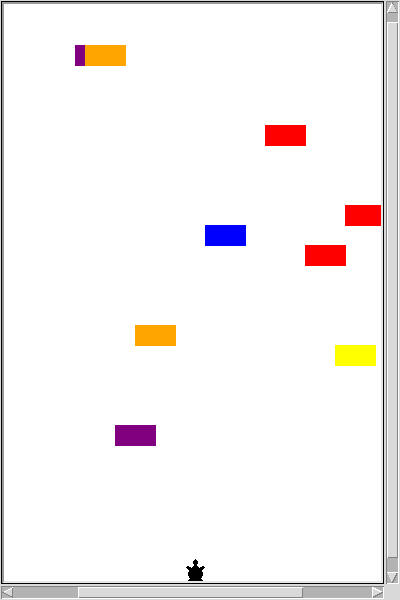

# 🐢 Turtle Crossing Game

An arcade-style road-crossing game built in Python with the `turtle` graphics library, inspired by Frogger.



## How to play
- Press the `↑` key to move the turtle forward
- Avoid the randomly generated cars moving across the road
- Reach the top to advance to the next level. Each level is faster than the last
- Getting hit by a car ends the game

## How to run
Requires Python 3 (the `turtle` module is included with Python).

```bash
python main_crossing.py
```

## Project structure
| File | Purpose |
|------|---------|
| `main_crossing.py` | Main game loop |
| `Player.py` | The player's turtle |
| `Car.py` | Car creation and movement |
| `level.py` | Level display and game-over message |

## What I learned
Generating random objects, managing lists of moving objects, collision detection and increasing difficulty over time.

---
Built while following Dr. Angela Yu's *100 Days of Code: The Complete Python Pro Bootcamp* (Udemy).
